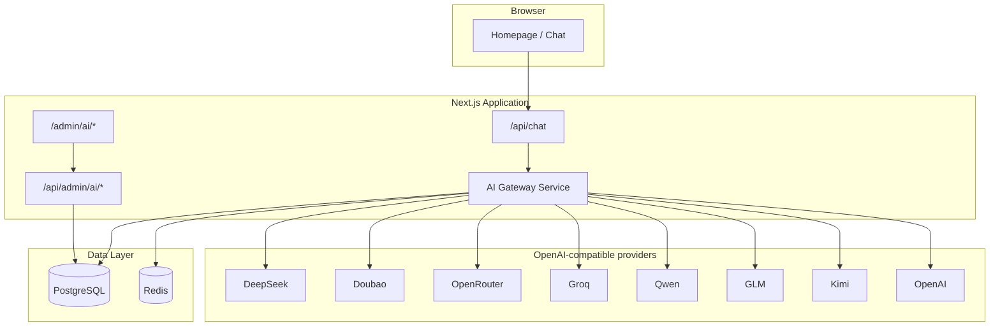
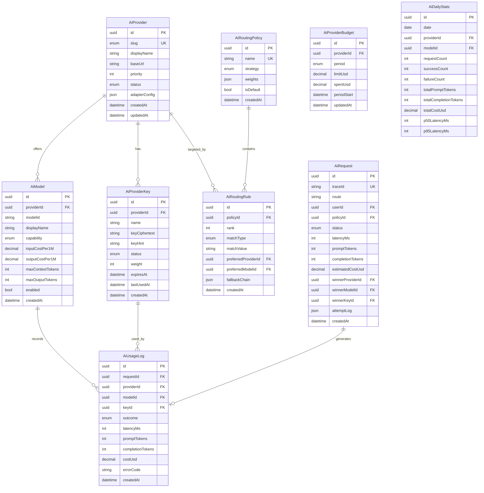
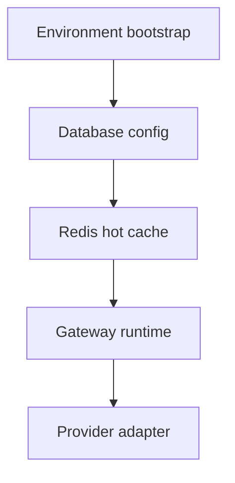
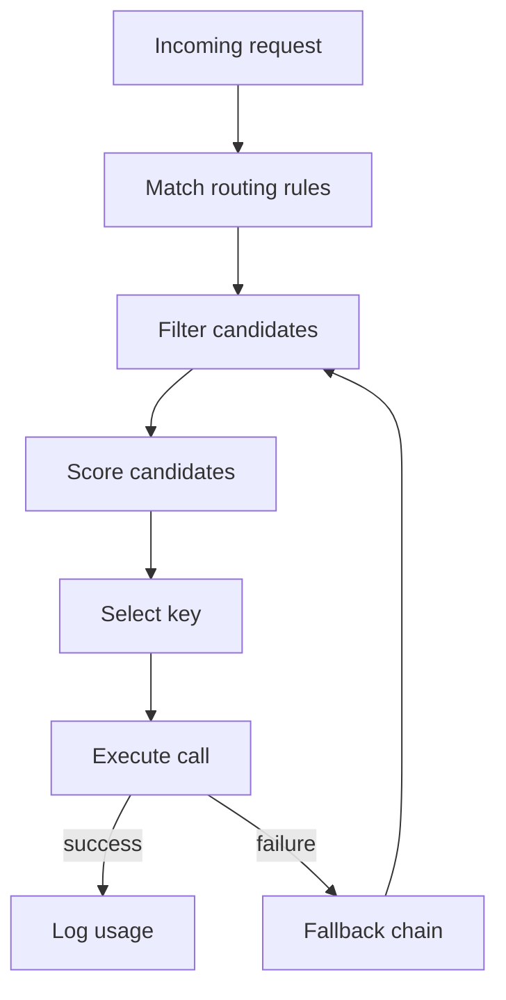
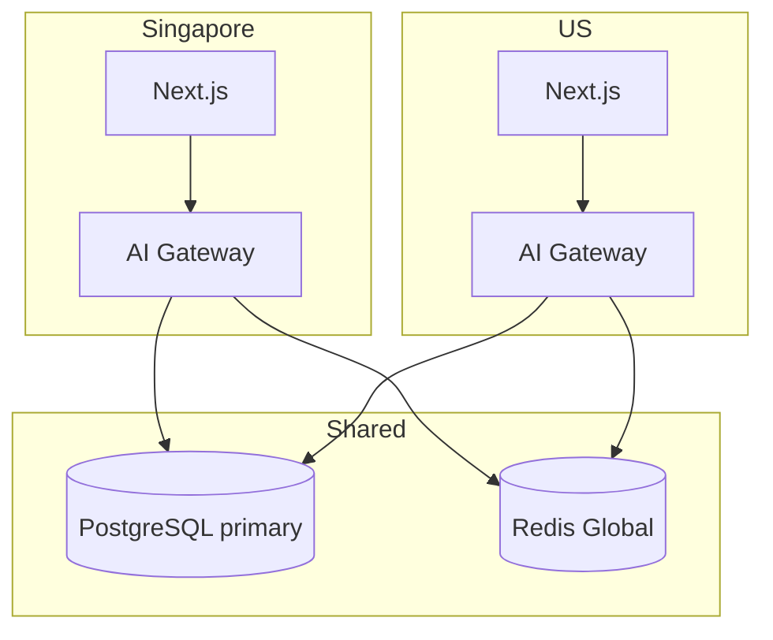

# Nexvo AI Gateway — Architecture

**Project:** Nexvo  
**Status:** Design (not implemented)  
**Related:** [ARCHITECTURE.md](./ARCHITECTURE.md) · [PRD.MD](./PRD.MD)

---

## 1. Purpose

The **AI Gateway** is Nexvo’s internal control plane for all large-language-model traffic. Today, `POST /api/chat` calls OpenAI directly with a single API key and model. The gateway replaces that direct coupling with a **provider-agnostic orchestration layer** that:

- Lets administrators configure **multiple AI providers and API keys** without redeploying the app.
- **Automatically selects the best provider** for each request based on policy, cost, latency, and health.
- **Tracks cost and usage** per provider, model, route, and tenant.
- **Fails over gracefully** when a provider is down, rate-limited, or over budget.
- Preserves Nexvo’s trust principles: no merchant influence on routing, full auditability, privacy-first logging.

All supported providers are assumed to expose an **OpenAI-compatible Chat Completions API** (`POST /v1/chat/completions`). The gateway speaks one protocol; provider-specific quirks are handled in thin adapters.

### Supported providers (v1)

| Provider | Typical base URL | Notes |
|----------|------------------|-------|
| DeepSeek | `https://api.deepseek.com/v1` | Cost-efficient reasoning |
| Doubao | `https://ark.cn-beijing.volces.com/api/v3` | ByteDance; region-aware |
| OpenRouter | `https://openrouter.ai/api/v1` | Multi-model aggregator |
| Groq | `https://api.groq.com/openai/v1` | Low-latency inference |
| Qwen | `https://dashscope.aliyuncs.com/compatible-mode/v1` | Alibaba Cloud |
| GLM | `https://open.bigmodel.cn/api/paas/v4` | Zhipu; verify path compatibility |
| Kimi | `https://api.moonshot.cn/v1` | Moonshot |
| OpenAI | `https://api.openai.com/v1` | Reference implementation |

### High-level placement



---

## 2. Database Schema

PostgreSQL is the system of record. Prisma manages migrations. Secrets are **never stored in plaintext** in the database (see §9 Security).

### Entity relationship



### Table definitions

#### `AiProvider`

Registry of upstream LLM vendors.

| Column | Type | Description |
|--------|------|-------------|
| `slug` | enum | `deepseek`, `doubao`, `openrouter`, `groq`, `qwen`, `glm`, `kimi`, `openai` |
| `displayName` | string | Admin UI label |
| `baseUrl` | string | OpenAI-compatible base URL |
| `priority` | int | Default tie-breaker when scores are equal (lower = preferred) |
| `status` | enum | `active`, `degraded`, `disabled` |
| `adapterConfig` | json | Provider-specific overrides (auth header name, path prefix, extra headers) |

#### `AiProviderKey`

Multiple keys per provider for rotation, sharding, and blast-radius control.

| Column | Type | Description |
|--------|------|-------------|
| `keyCiphertext` | string | AES-256-GCM encrypted secret (see §9) |
| `keyHint` | string | Last 4 chars for admin identification |
| `status` | enum | `active`, `rate_limited`, `invalid`, `revoked` |
| `weight` | int | Load-balancing weight among active keys |
| `expiresAt` | datetime | Optional key rotation deadline |

#### `AiModel`

Catalog of models available through each provider.

| Column | Type | Description |
|--------|------|-------------|
| `modelId` | string | Provider-native model string (e.g. `gpt-4o-mini`, `deepseek-chat`) |
| `capability` | enum | `chat`, `reasoning`, `fast`, `vision` (future) |
| `inputCostPer1M` | decimal | USD per 1M input tokens (admin-maintained or synced) |
| `outputCostPer1M` | decimal | USD per 1M output tokens |
| `enabled` | bool | Soft-disable without deleting |

#### `AiRoutingPolicy`

Named routing strategy applied to a class of traffic.

| Column | Type | Description |
|--------|------|-------------|
| `strategy` | enum | `cost_optimized`, `latency_optimized`, `quality_first`, `balanced` |
| `weights` | json | Scoring weights (see §4 Routing Algorithm) |
| `isDefault` | bool | Exactly one default policy |

#### `AiRoutingRule`

Optional overrides for specific traffic patterns.

| Column | Type | Description |
|--------|------|-------------|
| `rank` | int | Evaluation order (ascending) |
| `matchType` | enum | `route`, `user_tier`, `locale`, `task`, `model_capability` |
| `matchValue` | string | e.g. `/api/chat`, `sg`, `recommendation` |
| `fallbackChain` | json | Ordered list of `{ providerId, modelId }` |

#### `AiRequest`

One row per inbound gateway call (correlates to a user-facing API request).

| Column | Type | Description |
|--------|------|-------------|
| `traceId` | string | W3C trace id / Nexvo request id |
| `route` | string | e.g. `chat`, `trust_eval`, `moderation` |
| `attemptLog` | json | Ordered provider attempts with outcomes |
| `status` | enum | `success`, `partial`, `failed`, `budget_blocked` |

#### `AiUsageLog`

One row per **provider attempt** (including fallbacks). Source of truth for cost and SLO metrics.

#### `AiProviderBudget`

Hard or soft spend caps per provider per period (`daily`, `monthly`).

#### `AiDailyStats`

Pre-aggregated rollups for admin dashboards (populated by a nightly job or streaming aggregator).

### Indexes

| Table | Index | Purpose |
|-------|-------|---------|
| `AiUsageLog` | `(createdAt, providerId)` | Time-range cost queries |
| `AiRequest` | `(traceId)` | Distributed tracing |
| `AiRequest` | `(userId, createdAt)` | Per-user quotas |
| `AiDailyStats` | `(date, providerId, modelId)` UNIQUE | Upsert rollups |
| `AiProviderKey` | `(providerId, status)` | Fast key selection |

### Migration from Phase 1

1. Seed `AiProvider` row for OpenAI with existing env key migrated into `AiProviderKey`.
2. Point `POST /api/chat` at the gateway with route `chat` and default policy `balanced`.
3. Retire direct `OPENAI_API_KEY` usage in application code after cutover.

---

## 3. Provider Configuration Model

Configuration is **data-driven** (database + admin UI), with **environment fallbacks** only for bootstrap and disaster recovery.

### Configuration layers



| Layer | Source | TTL | Purpose |
|-------|--------|-----|---------|
| Bootstrap | `AI_GATEWAY_MASTER_KEY`, initial admin | Static | Decrypt keys; first provider seed |
| Database | `AiProvider`, `AiModel`, keys, policies | Authoritative | Admin-managed config |
| Redis cache | Snapshot of active config | 60s (+ pub/sub invalidation) | Avoid DB hit per request |
| Runtime | In-memory circuit breakers | Per-process | Fast health state |

### Provider record shape (logical)

Each provider entry contains:

- **Identity** — slug, display name, status.
- **Endpoint** — base URL, optional custom path, timeout (default 30s chat / 120s reasoning).
- **Authentication** — one or more encrypted API keys with weights.
- **Models** — enabled models with cost tables and token limits.
- **Health** — last probe result, error rate window, circuit state.
- **Budget** — optional daily/monthly USD cap.
- **Adapter overrides** — e.g. Doubao requires `Authorization: Bearer <key>` plus vendor-specific headers; OpenRouter requires `HTTP-Referer` and `X-Title`.

### Key rotation workflow

1. Admin adds new key with status `active`, weight 0.
2. Admin runs **canary probe** from admin UI (test completion against one model).
3. Admin increases weight; old key weight decreases.
4. Old key moves to `revoked` after cooldown.

### Model catalog management

- **Manual** — Admin enters model id and cost per 1M tokens.
- **Semi-automatic (future)** — OpenRouter model list sync job writes to staging table; admin approves merge.
- **Disabled models** — Excluded from routing but retained for historical cost reports.

### Policy binding

| Traffic class | Default policy | Example override rule |
|---------------|----------------|------------------------|
| `POST /api/chat` | `balanced` | Singapore users → prefer Qwen/Doubao for locale |
| Trust evaluation (future) | `quality_first` | Always OpenAI or DeepSeek reasoning |
| Moderation (future) | `latency_optimized` | Groq fast model |

---

## 4. Routing Algorithm

The gateway selects a **(provider, model, key)** triple for each request using a scored ranking pipeline.

### Request context

Each gateway invocation receives:

| Field | Source | Used for |
|-------|--------|----------|
| `route` | API handler | Rule matching |
| `messages` | Caller | Token estimate, capability check |
| `task` | Caller metadata | e.g. `recommendation`, `summary` |
| `locale` | User preference / geo | Regional provider preference |
| `userTier` | Clerk claims | Free vs paid quotas |
| `maxCostUsd` | Policy | Hard ceiling per request |
| `requiredCapability` | Caller | `chat`, `reasoning`, etc. |

### Pipeline



### Step 1 — Rule matching

Evaluate `AiRoutingRule` rows for the active policy in `rank` order. First match wins and may:

- Restrict the candidate set to specific providers/models.
- Set a `fallbackChain`.
- Override scoring strategy for this request.

If no rule matches, use the policy’s global candidate pool (all enabled models across active providers).

### Step 2 — Hard filters (elimination)

Remove candidates that:

- Provider or model `enabled = false`.
- Provider `status = disabled`.
- Circuit breaker is **open** (see §6).
- Estimated request cost exceeds `maxCostUsd` or remaining provider budget.
- Model `maxContextTokens` insufficient for estimated input.
- Key pool has zero `active` keys.
- Provider in `degraded` unless no alternatives remain.

### Step 3 — Scoring

For each remaining candidate, compute a **composite score** (higher = better). Default weights for `balanced` policy:

| Signal | Weight | Measurement |
|--------|--------|-------------|
| Cost | 0.30 | Estimated USD from token count × model rates |
| Latency | 0.25 | Rolling p95 from `AiUsageLog` (last 15 min) |
| Quality | 0.25 | Static model tier + historical success rate for route |
| Availability | 0.20 | Key health + provider error rate |

**Strategy presets** adjust weights:

| Strategy | Cost | Latency | Quality | Availability |
|----------|------|---------|---------|--------------|
| `cost_optimized` | 0.50 | 0.15 | 0.15 | 0.20 |
| `latency_optimized` | 0.15 | 0.50 | 0.15 | 0.20 |
| `quality_first` | 0.10 | 0.15 | 0.55 | 0.20 |
| `balanced` | 0.30 | 0.25 | 0.25 | 0.20 |

**Tie-breakers** (in order): higher availability → lower cost → lower provider `priority` value → lexicographic provider slug (deterministic).

### Step 4 — Key selection

Among active keys for the chosen provider, select via **weighted random** using `AiProviderKey.weight`. Keys marked `rate_limited` are skipped until TTL expires (stored in Redis).

### Step 5 — Execution

Issue `POST {baseUrl}/chat/completions` with unified payload. Record winner and latency. On failure, enter fallback (§6).

### Token estimation

Pre-call estimate uses a fast heuristic (character count / 4 or tiktoken when available). Post-call actuals from provider `usage` block overwrite estimates in `AiUsageLog`.

### Nexvo-specific constraints

- Routing must **never** consider merchant identity, sponsorship, or affiliate relationships.
- Recommendation routes log `policyId` and `attemptLog` for transparency audits.
- Admin manual provider pinning is supported for debugging but disabled in production by default.

---

## 5. Cost Tracking

### Cost calculation

```
costUsd =
  (promptTokens / 1_000_000) × inputCostPer1M
  + (completionTokens / 1_000_000) × outputCostPer1M
```

- Rates come from `AiModel` at request time (snapshot in `AiUsageLog` for historical accuracy).
- If provider returns no usage block, estimate from response length and flag row `usageEstimated = true`.

### Budget enforcement

| Level | Mechanism | Behavior |
|-------|-----------|----------|
| Provider daily/monthly | `AiProviderBudget` | Soft warn at 80%; hard block at 100% |
| Per-request | Policy `maxCostUsd` | Exclude over-budget models in filter step |
| Per-user (future) | Clerk tier + Redis counter | 429 when free tier exceeded |

Budget counters increment synchronously on success (Redis `INCRBYFLOAT`) and reconcile to PostgreSQL hourly.

### Cost attribution dimensions

Every `AiUsageLog` row is tagged with:

- `providerId`, `modelId`, `keyId`
- `route`, `policyId`
- `userId` (nullable for anonymous Phase 1)
- `traceId`

### Reporting surfaces

| Report | Granularity | Admin UI location |
|--------|-------------|-------------------|
| Spend today / MTD | Provider, model | Dashboard |
| Cost per route | `chat`, future routes | Usage page |
| Cost per 1k requests | Derived | Usage page |
| Budget burn | Provider | Providers page |
| Export CSV | Any filter | Usage page |

### Alerts (future)

- Email/webhook when provider hits 80% budget.
- Anomaly detection: 2× normal hourly spend.

---

## 6. Fallback Strategy

### Failure taxonomy

| Class | Examples | Retry same provider? |
|-------|----------|----------------------|
| Transient | 429, 502, 503, timeout | Yes (with backoff) |
| Auth | 401, 403 | No — mark key `invalid` |
| Client | 400, 413 | No — fail request |
| Empty completion | 200 but no content | Yes — next model |
| Budget | Provider cap hit | No — exclude provider |

### Fallback order

1. **Same provider, alternate key** — if failure looks rate-limit related.
2. **Same provider, alternate model** — if model-specific error.
3. **Next entry in `fallbackChain`** — from matched routing rule.
4. **Next highest-scored candidate** — re-run filter + score excluding failed pairs.
5. **Default safe model** — OpenAI `gpt-4o-mini` or last-resort configured in policy.

Maximum **3 provider attempts** and **5 total attempts** per request to cap latency.

### Circuit breaker

Per `(providerId)` in Redis:

| State | Condition | Duration |
|-------|-----------|----------|
| Closed | Normal | — |
| Open | ≥5 failures in 60s OR p95 > 10s | 30s |
| Half-open | Probe request | 1 success → closed; 1 fail → open |

Circuit state feeds the availability score in §4.

### User-visible behavior

- Client receives a single `{ answer }` on success — fallback is invisible.
- On total failure: HTTP 502 with generic message; `traceId` in response header for support.
- Development mode may expose `X-Nexvo-Provider` header (stripped in production).

### Idempotency

`AiRequest.traceId` deduplicates retries from the client within a 5-minute window (optional Phase 2).

---

## 7. Usage Statistics

### Real-time metrics (Redis)

| Key pattern | Metric |
|-------------|--------|
| `ai:stats:{provider}:rpm` | Requests per minute |
| `ai:stats:{provider}:err_rate` | Error rate sliding window |
| `ai:stats:{provider}:p95_ms` | Latency p95 |
| `ai:budget:{provider}:{period}` | Spend accumulator |

### Persistent aggregates

`AiDailyStats` populated by:

1. **Streaming** — On each `AiUsageLog` insert, increment daily rollup (upsert).
2. **Batch reconciliation** — Nightly job verifies rollups against raw logs.

### Admin dashboard KPIs

| KPI | Definition |
|-----|------------|
| Total requests (24h) | Count of `AiRequest` |
| Success rate | `success / total` |
| Avg cost per request | `sum(costUsd) / count` |
| p95 latency | From `AiRequest.latencyMs` |
| Top model by volume | Group by `modelId` |
| Top model by cost | Group by `costUsd` sum |
| Fallback rate | Requests where `attemptLog.length > 1` |

### Observability integration

- Structured logs: `[AI_GATEWAY] traceId, provider, model, latencyMs, tokens, costUsd, outcome`.
- OpenTelemetry spans: `ai.gateway.route`, `ai.provider.call`.
- Metrics exported to Prometheus/Datadog (future).

### Data retention

| Data | Retention |
|------|-----------|
| `AiUsageLog` raw | 90 days |
| `AiDailyStats` | 2 years |
| `AiRequest.attemptLog` | 30 days (truncate older) |

Align with Nexvo privacy policy; no prompt/response content stored in gateway tables by default.

---

## 8. Admin UI Pages

All admin routes require **Clerk authentication** with `role = admin` (or Nexvo org admin). Layout follows existing `PageShell` patterns under `/admin`.

### Page map

| Route | Purpose |
|-------|---------|
| `/admin/ai` | Dashboard — KPIs, alerts, quick health |
| `/admin/ai/providers` | List providers; enable/disable |
| `/admin/ai/providers/[slug]` | Edit base URL, adapter config, priority, status |
| `/admin/ai/providers/[slug]/keys` | Add, rotate, revoke API keys |
| `/admin/ai/models` | Model catalog; costs; enable/disable |
| `/admin/ai/routing` | Policies and rules editor |
| `/admin/ai/routing/policies/[id]` | Weight sliders, default policy toggle |
| `/admin/ai/routing/rules` | Ordered rule list with drag-rank |
| `/admin/ai/usage` | Charts, filters, CSV export |
| `/admin/ai/budgets` | Per-provider caps |
| `/admin/ai/logs` | Request trace lookup by `traceId` |
| `/admin/ai/probes` | Manual test completion against any model |

### Dashboard (`/admin/ai`)

- Cards: requests 24h, success rate, spend today, active providers.
- Line chart: requests and cost over 7 days.
- Provider health table: status, p95, error rate, budget remaining.
- Recent failures list with trace links.

### Providers editor

- Form fields: display name, base URL, priority, status, adapter JSON (validated schema).
- **Test connection** button runs probe completion.
- Key management sub-page: add key (paste once), show hint only after save.

### Routing editor

- Visual policy selector with strategy preset.
- Rule builder: match type dropdown, value input, preferred provider/model pickers, fallback chain builder.
- **Simulate routing** — admin pastes sample request metadata, sees ranked candidates without calling providers.

### Usage explorer

- Filters: date range, provider, model, route, outcome.
- Table: timestamp, route, provider, model, tokens, cost, latency, outcome.
- Aggregations toggle: by hour / day / provider / model.

### UX principles

- Destructive actions (revoke key, disable provider) require confirmation modal.
- Never display full API keys after initial save.
- Show last config change author and timestamp (audit log).

---

## 9. API Routes

### Public / application routes

These routes call the gateway internally. Clients never send provider or API keys.

| Method | Path | Description |
|--------|------|-------------|
| `POST` | `/api/chat` | Existing chat; gateway route `chat` |
| `POST` | `/api/trust/evaluate` | Future trust LLM pass; route `trust_eval` |
| `POST` | `/api/moderation/check` | Future content moderation; route `moderation` |

**Gateway internal interface (conceptual)**

```
complete({
  route: string,
  messages: Message[],
  task?: string,
  locale?: string,
  userId?: string,
  requiredCapability?: Capability,
  maxTokens?: number,
  temperature?: number,
}): Promise<GatewayResult>
```

`GatewayResult`:

| Field | Type | Description |
|-------|------|-------------|
| `content` | string | Assistant text |
| `traceId` | string | Correlation id |
| `provider` | string | Winning provider slug |
| `model` | string | Winning model id |
| `usage` | object | Token counts and cost |

### Admin API routes

All require Clerk session + admin role. CSRF protection on mutating routes.

| Method | Path | Description |
|--------|------|-------------|
| `GET` | `/api/admin/ai/dashboard` | KPI summary |
| `GET` | `/api/admin/ai/providers` | List providers |
| `POST` | `/api/admin/ai/providers` | Create provider |
| `PATCH` | `/api/admin/ai/providers/[id]` | Update provider |
| `GET` | `/api/admin/ai/providers/[id]/keys` | List keys (hints only) |
| `POST` | `/api/admin/ai/providers/[id]/keys` | Add encrypted key |
| `PATCH` | `/api/admin/ai/providers/[id]/keys/[keyId]` | Update weight/status |
| `DELETE` | `/api/admin/ai/providers/[id]/keys/[keyId]` | Revoke key |
| `GET` | `/api/admin/ai/models` | List models |
| `PATCH` | `/api/admin/ai/models/[id]` | Update model/costs |
| `GET` | `/api/admin/ai/routing/policies` | List policies |
| `PUT` | `/api/admin/ai/routing/policies/[id]` | Update policy |
| `GET` | `/api/admin/ai/routing/rules` | List rules |
| `PUT` | `/api/admin/ai/routing/rules` | Replace ordered rules |
| `POST` | `/api/admin/ai/routing/simulate` | Dry-run routing |
| `GET` | `/api/admin/ai/usage` | Paginated usage logs |
| `GET` | `/api/admin/ai/usage/export` | CSV export |
| `GET` | `/api/admin/ai/budgets` | List budgets |
| `PUT` | `/api/admin/ai/budgets/[providerId]` | Set caps |
| `POST` | `/api/admin/ai/probes` | Run test completion |
| `GET` | `/api/admin/ai/traces/[traceId]` | Request attempt detail |
| `POST` | `/api/admin/ai/cache/invalidate` | Bust Redis config cache |

### Webhooks (future)

| Event | Payload |
|-------|---------|
| `ai.budget.warning` | provider, percent, period |
| `ai.provider.circuit_open` | provider, reason |
| `ai.key.invalid` | provider, keyHint |

---

## 10. Security Rules

### Secret management

| Rule | Implementation |
|------|----------------|
| No plaintext keys in DB | AES-256-GCM with `AI_GATEWAY_MASTER_KEY` (32 bytes, KMS in production) |
| No keys in logs | Redact `Authorization` headers |
| No keys in client | Admin paste-once; server returns hint only |
| Env bootstrap only | Single initial key for disaster recovery |

### Access control

| Actor | Permissions |
|-------|-------------|
| Anonymous user | Call `/api/chat` only; rate limited |
| Authenticated user | Same + higher quota (future) |
| Admin | Full admin API + UI |
| Service account | Internal probe jobs only |

Use Clerk JWT verification on all `/api/admin/ai/*` routes. Consider IP allowlist for admin UI in production.

### Transport and headers

- TLS required for all provider calls.
- Store allowed `baseUrl` patterns per provider slug to prevent SSRF via admin misconfiguration.
- Timeout all upstream calls; no redirect following.

### Audit logging

Append-only `AiAdminAuditLog`:

| Action | Fields |
|--------|--------|
| `provider.updated` | adminId, providerId, diff |
| `key.added` / `key.revoked` | adminId, providerId, keyHint |
| `policy.updated` | adminId, policyId, diff |

### Privacy

- Do **not** persist message content in gateway tables by default.
- `traceId` links to application logs if needed for support (with retention policy).
- Usage stats contain token counts only, not prompts.

### Threat model highlights

| Threat | Mitigation |
|--------|------------|
| Admin account compromise | MFA, audit log, key rotation |
| API key leak | Per-key revoke, hint-only display |
| Cost explosion | Budget caps, per-user rate limits, max attempts |
| SSRF via custom baseUrl | Allowlist validation |
| Prompt injection affecting routing | Routing ignores message content except token estimate |

---

## 11. Future Scalability

### Phase A — Monolith (MVP gateway)

- Gateway runs as a TypeScript module inside Next.js (`src/lib/ai-gateway/`).
- Redis optional; in-memory circuit breakers acceptable at low traffic.
- Single PostgreSQL instance.

Suited for Phase 1–3 traffic.

### Phase B — Sidecar service

- Extract gateway to a dedicated Node service behind internal network.
- Next.js calls `http://ai-gateway:8080/v1/complete`.
- Redis required for cross-instance circuit breakers and budget counters.
- Config cache pub/sub on admin changes.

### Phase C — Multi-region



- Route users to regional gateways for latency to Doubao/Qwen.
- Provider keys may be region-scoped in `adapterConfig`.
- `AiDailyStats` partitioned by month.

### Phase D — Advanced capabilities

| Capability | Description |
|------------|-------------|
| **Streaming** | SSE passthrough with per-chunk latency metrics |
| **Embeddings route** | Separate `capability = embedding` pool |
| **Vision** | Screenshot moderation for purchase proofs |
| **A/B testing** | Route percentage to model B; compare trust outcomes |
| **Auto cost sync** | OpenRouter pricing API nightly import |
| **Smart batching** | Queue non-latency-sensitive trust jobs |
| **Dedicated GPU providers** | Self-hosted vLLM behind same adapter interface |

### Performance targets

| Metric | Target (p95) |
|--------|--------------|
| Gateway overhead (excl. provider) | < 50 ms |
| Config cache hit | > 99% |
| Fallback added latency | < 2× single provider timeout |
| Admin dashboard load | < 1s for 7-day aggregates |

### Integration with Trust Engine

The Trust Engine consumes gateway metadata (`provider`, `model`, `confidence` hooks) but **never** influences routing. Trust scoring remains independent of which provider answered — preserving the “evidence before opinion” principle.

---

## Appendix A — Default seed configuration

Recommended initial setup for Nexvo MVP cutover:

| Provider | Model | Role |
|----------|-------|------|
| OpenAI | `gpt-4o-mini` | Default fallback, quality baseline |
| DeepSeek | `deepseek-chat` | Cost-efficient primary |
| Groq | `llama-3.3-70b-versatile` | Latency-sensitive paths |
| OpenRouter | `openai/gpt-4o-mini` | Aggregator fallback |

Policy: `balanced` with fallback chain `[deepseek-chat → gpt-4o-mini → openrouter]`.

---

## Appendix B — Glossary

| Term | Definition |
|------|------------|
| **Gateway** | Nexvo orchestration layer for LLM calls |
| **Provider** | Upstream vendor (DeepSeek, OpenAI, etc.) |
| **Adapter** | Thin client normalizing OpenAI-compatible APIs |
| **Policy** | Named routing strategy with scoring weights |
| **Rule** | Conditional override within a policy |
| **Trace** | End-to-end id linking client request to provider attempts |

---

## Appendix C — Related documents

| Document | Relevance |
|----------|-----------|
| [ARCHITECTURE.md](./ARCHITECTURE.md) | System overview, current `/api/chat` |
| [roadmap.md](./roadmap.md) | Phase planning |
| [VISION.MD](./VISION.MD) | Trust and privacy constraints |
