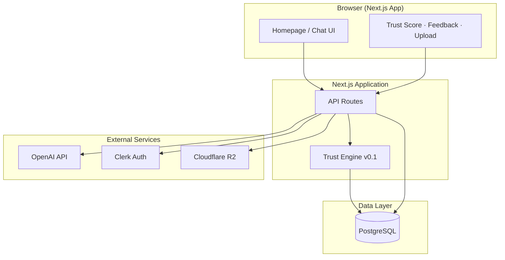
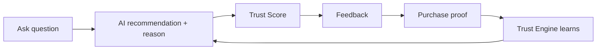
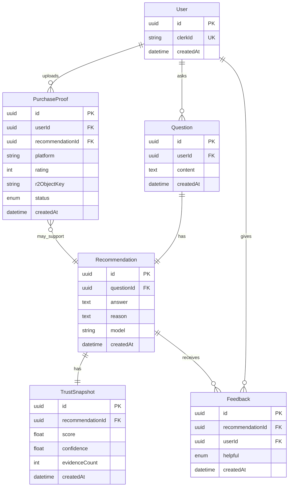
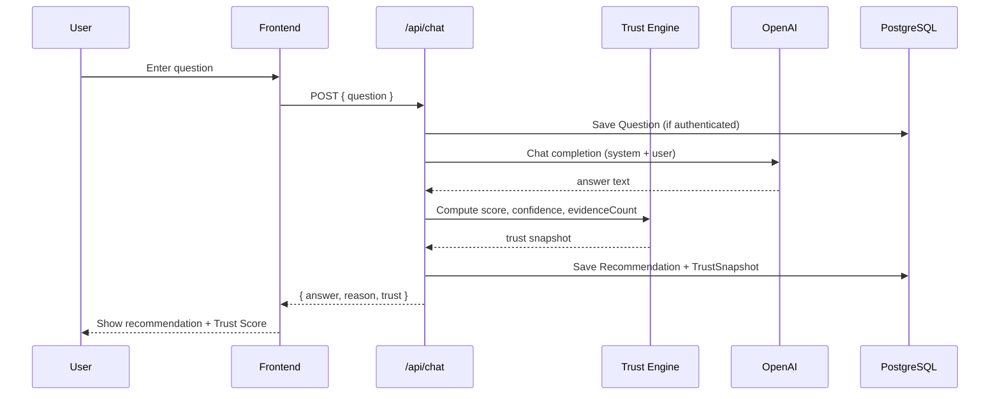
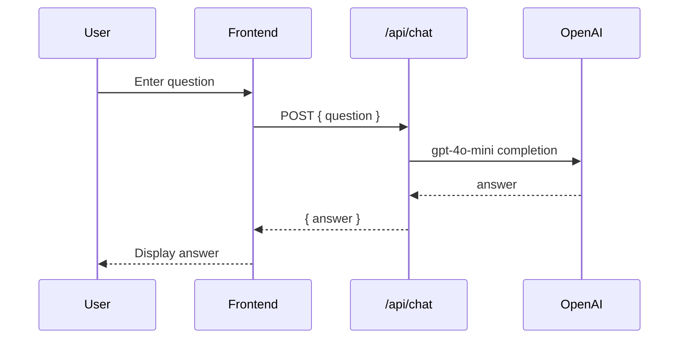
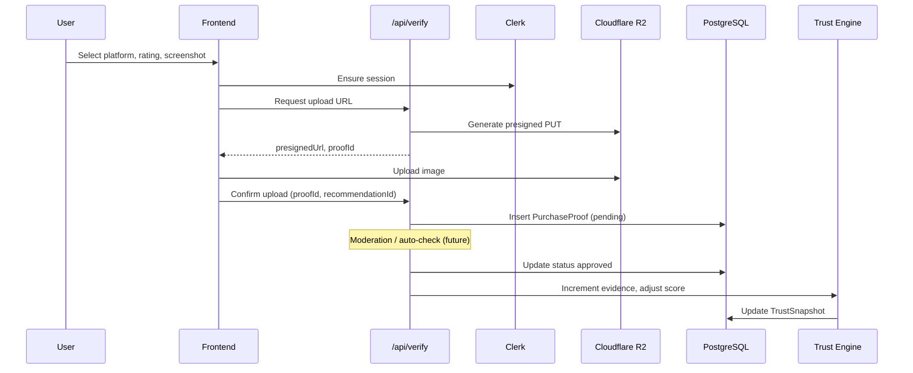
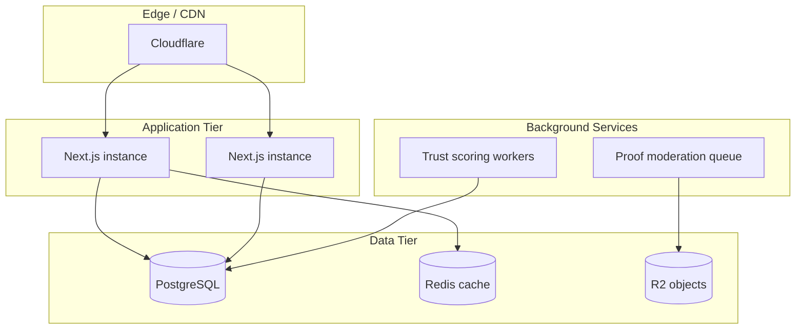

# Nexvo MVP — Technical Architecture

**Project:** Nexvo  
**Mission:** We don't rank products for merchants. We verify choices for people.

This document describes the MVP technical architecture: what exists today (Phase 1), what is planned per the [roadmap](./roadmap.md) and [PRD](./PRD.MD), and how the **Trust Engine™** fits into the system.

---

## 1. System Overview

Nexvo is a **trust-first AI decision platform**. Users ask a question, receive a recommendation with reasoning, see a **Trust Score**, provide feedback, and optionally upload **purchase proof** so the Trust Engine can improve over time.

### High-level diagram



### MVP closed loop (product)



### Trust principles (non-negotiable)

From [VISION.MD](./VISION.MD):

- No ads, sponsored rankings, or merchant influence on rankings
- Evidence before opinion
- Privacy first, transparency always

These constraints shape API design, data retention, and what the Trust Engine may use as signals.

### Implementation status vs roadmap

| Phase | Capability | Status |
|-------|------------|--------|
| 1 | Homepage, AI chat, OpenAI | **In progress** — `src/app/page.tsx`, `POST /api/chat` |
| 2 | Trust score, recommendation reasoning | Planned |
| 3 | User login (Google, Apple via Clerk) | Planned |
| 4 | Purchase verification, screenshot upload | Planned |
| 5 | Feedback, Trust Engine v1 | Planned |
| 6 | Docker deployment on Ubuntu 24.04 | Planned |

---

## 2. Frontend Architecture

### Stack

| Layer | Technology |
|-------|------------|
| Framework | Next.js 16 (App Router) |
| Language | TypeScript |
| UI | React 19, Tailwind CSS v4 |
| Data fetching | `fetch` to same-origin API routes |

### Structure (current and planned)

```
src/
  app/                # Next.js App Router (pages + API)
    layout.tsx
    page.tsx
    globals.css
    api/chat/route.ts
    recommendation/ verify/ feedback/ why/ trust/
  components/         # Shared UI
  design-system/      # Button, Card, tokens
  hooks/
  lib/
```

### Homepage (`src/app/page.tsx`)

- **Client component** (`"use client"`) for local state: `question`, `answer`
- User submits a question → `POST /api/chat` with `{ "question": string }`
- Renders AI answer in a card below the form

### Planned UI modules (PRD)

| Module | Responsibility |
|--------|----------------|
| Recommendation | Product pick + human-readable reason |
| Trust display | `score`, `confidence`, `evidenceCount` |
| Feedback | Helpful / Not helpful |
| Purchase verification | Screenshot upload, platform, rating |
| Voice input | Future — not in MVP Phase 1 |

### Client ↔ API contract

All chat responses are **JSON** with a stable shape:

**Success (200)**

```json
{ "answer": "..." }
```

**Error (4xx / 5xx)**

```json
{ "error": "Human-readable message" }
```

The frontend should check `response.ok`, read `error` on failure, and never assume `answer` is present when status ≠ 200.

---

## 3. Backend Architecture

### Stack (target MVP)

| Concern | Technology |
|---------|------------|
| Runtime | Node.js (via Next.js) |
| API | Next.js Route Handlers under `src/app/api/` |
| ORM | Prisma |
| Database | PostgreSQL |
| Auth | Clerk |
| Object storage | Cloudflare R2 (purchase screenshots) |
| AI | OpenAI (`gpt-4o-mini` for broad API availability) |
| Deploy | Docker on Ubuntu 24.04 |

### API routes (planned layout)

```
src/app/api/
  chat/route.ts           # Phase 1 — Q&A / recommendations
  feedback/route.ts       # Phase 5 — helpful / not helpful
  verify/route.ts         # Phase 4 — purchase proof upload metadata
  trust/route.ts          # Phase 2 — trust metadata for a recommendation
```

### `POST /api/chat` (implemented)

**Request**

```http
POST /api/chat
Content-Type: application/json

{ "question": "string, 1–4000 chars after trim" }
```

**Behavior**

1. Validate `OPENAI_API_KEY` is set (503 if missing).
2. Parse and validate JSON body and `question`.
3. Call OpenAI Chat Completions: model `gpt-4o-mini`, system prompt defines Nexvo persona.
4. Return trimmed assistant text as `answer`.

**Error handling**

| Condition | HTTP | Logged |
|-----------|------|--------|
| Missing API key | 503 | Yes |
| Invalid JSON / body / question | 400 | Yes (parse errors) |
| OpenAI rate limit | 429 | Yes (structured `APIError`) |
| OpenAI auth / permission | 503 | Yes |
| Other OpenAI errors | 502 | Yes |
| Empty model output | 502 | Yes |
| Unexpected errors | 500 | Yes |

Logs use prefix `[NEXVO API]`; OpenAI errors include status, message, code, type, and request id. Client messages stay generic; details stay server-side.

**Environment**

| Variable | Required | Purpose |
|----------|----------|---------|
| `OPENAI_API_KEY` | Yes (chat) | OpenAI authentication |

### Authentication (Phase 3)

- **Clerk** handles Google and Apple sign-in.
- Protected routes and API handlers verify Clerk session (JWT / middleware).
- Feedback and purchase proof are **user-scoped** once auth ships.

### File uploads (Phase 4)

1. Client requests a **presigned URL** from the API (authenticated).
2. Client uploads screenshot directly to **R2**.
3. API stores metadata (user id, platform, rating, object key) in PostgreSQL.

---

## 4. Database Design

PostgreSQL is the system of record. Prisma manages schema and migrations.

### Core entities (MVP target)



### Notes

- **Phase 1** may run without persistence (stateless chat); schema above supports Phases 2–5.
- `PurchaseProof.status`: e.g. `pending`, `approved`, `rejected` for moderation.
- PII minimization: store only what is needed for trust and verification; align retention with privacy policy.

---

## 5. Trust Engine v0.1

The Trust Engine is the core differentiator: it turns recommendations into **verifiable, scored** advice rather than opaque LLM output.

### v0.1 scope (Phase 2 — display only)

For each recommendation, compute and return three fields:

| Field | Type | Meaning |
|-------|------|---------|
| `score` | `number` (0–100) | Overall trust in this recommendation |
| `confidence` | `number` (0–1) | Model/system confidence in the score |
| `evidenceCount` | `integer` | Number of evidence items backing the score |

**Example API fragment (future `GET /api/trust` or embedded in chat response):**

```json
{
  "answer": "...",
  "reason": "...",
  "trust": {
    "score": 72,
    "confidence": 0.81,
    "evidenceCount": 3
  }
}
```

### v0.1 logic (initial, rule-based)

Until verified purchases and feedback exist at scale:

1. **Baseline** — Start from a neutral score (e.g. 50) with low `evidenceCount`.
2. **LLM self-check** — Optional structured pass: does the answer cite specifics, acknowledge uncertainty, avoid sponsored language?
3. **Evidence hooks** — Reserve slots for future signals: verified purchases, aggregated helpful votes, third-party data.

### v1 (Phase 5 — learning loop)

- Ingest **feedback** (helpful / not helpful) as weighted signals.
- Ingest **approved purchase proofs** as positive evidence.
- Recompute or fine-tune trust weights per category/platform (batch or on-write).
- Never let merchant payments influence `score` (enforced at product and schema policy level).

---

## 6. Recommendation Flow

### Sequence (target end state)



### Phase 1 (today)



### Recommendation content (PRD)

Each recommendation should eventually include:

- **Product recommendation** — what to choose
- **Recommendation reason** — why, in plain language
- **Trust block** — `score`, `confidence`, `evidenceCount`

Structured output (JSON schema or tool calling) will be added in Phase 2 to separate `answer`, `reason`, and `trust` reliably.

---

## 7. Purchase Verification Flow

### Goal

Users upload proof of purchase so the Trust Engine can treat real-world outcomes as **evidence**, not marketing claims.

### Flow



### PRD fields

- Screenshot upload
- Platform selection (e.g. Amazon, Shopify store)
- User rating of the purchase experience

### Privacy and security

- Images stored in **R2**, not on app servers.
- Access via presigned URLs with short TTL.
- Only authenticated users can upload; proofs linked to `userId`.
- Clear UX on what data is stored and why (transparency principle).

---

## 8. Future Architecture

### Near-term (post-MVP)

| Area | Direction |
|------|-----------|
| Trust Engine | ML or embedding-based evidence retrieval; category-specific models |
| Recommendations | RAG over verified corpora; explicit citation list in UI |
| Voice | Speech-to-text on homepage input |
| Observability | Structured logging, error tracking, OpenAI usage metrics |
| Rate limiting | Per-user and global limits on `/api/chat` |

### Scale-out (long term)



- **Horizontal scaling** — Stateless Next.js containers behind a load balancer.
- **Async jobs** — Queue for proof review, trust recomputation, and batch analytics.
- **Caching** — Redis for session-adjacent trust snapshots and rate limits.
- **Multi-region** — R2 + DB replication if user base globalizes.

### Platform boundaries

- **Nexvo app** — UX, orchestration, Trust Engine policy
- **Clerk** — Identity only
- **OpenAI** — Language generation (no merchant data training on user proofs without explicit policy)
- **R2** — Binary asset storage

---

## Appendix: Related documents

| Document | Contents |
|----------|----------|
| [VISION.MD](./VISION.MD) | Mission, trust principles, long-term goal |
| [PRD.MD](./PRD.MD) | User flow, feature list |
| [roadmap.md](./roadmap.md) | Phased delivery plan |

---

## Appendix: Key file reference (Phase 1)

| Path | Role |
|------|------|
| `src/app/page.tsx` | Homepage UI |
| `src/app/api/chat/route.ts` | Chat API, OpenAI integration, error handling |
| `src/app/layout.tsx` | App shell |
